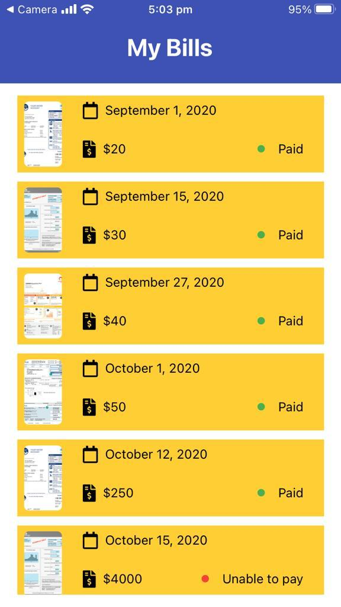

# How it works ?
App fetched dummy data from (https://my-json-server.typicode.com/A-monem/deferitBackend/db). Data are split into two batches to demonstrate the infinite scroll effect. Once receiving the first batch, user can scroll to the bottom and then the next batch will be loaded. User can also zoom on the bill thumbnail to check it properly. A tooltip will be displayed when clicking on the bill status.

# Where is it available ?
A workable built is available in here (https://snack.expo.io/@git/github.com/A-monem/deferit)

# How much it took me to build it ?
It took me seven hours. App testing (Jest) took most of the time and to be honest I wasn't really successful implementing serious tests.

# Built with

  * React Native Expo
  * react-native-responsive-screen
  * React-native-elements

  imgaes are hosted in an AWS S3 bucket

# Screenshots

